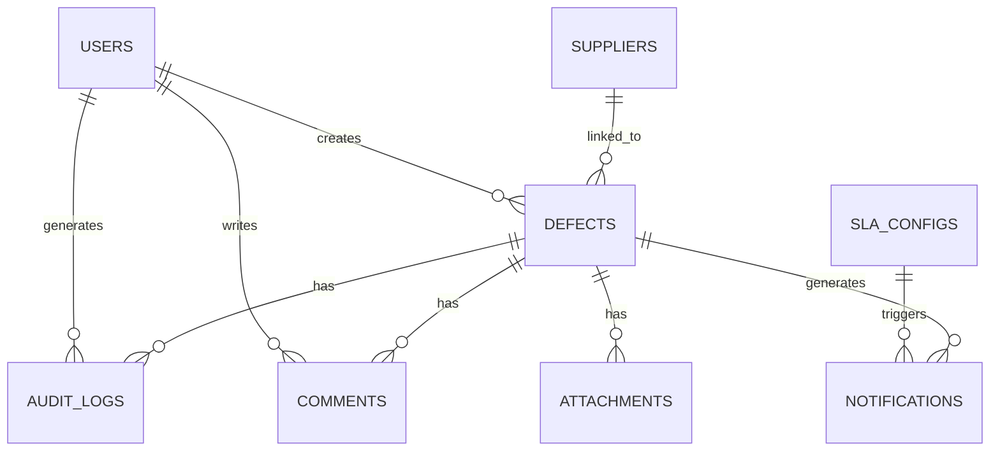

# QTrack System - Vendor Defect Tracking

<p align="center">
  
</p>

<p align="center">
  
  
  
  
  
  
</p>

Sistema de Gestão da Qualidade para rastreamento e controle de defeitos de fornecedores em ambiente de manufatura. Permite o gerenciamento completo do ciclo de vida de não-conformidades, desde a abertura até o fechamento, seguindo a metodologia 8D.

> **Nota:** Todos os dados presentes neste repositório (nomes de fornecedores, modelos, clientes, part numbers e materiais) são **fictícios** e utilizados exclusivamente para fins de demonstração. Nenhuma informação real de empresa ou produto está contida neste projeto.

---

## Índice

- [Visão Geral](#visão-geral)
- [Funcionalidades](#funcionalidades)
- [Arquitetura](#arquitetura)
- [Stack Tecnológica](#stack-tecnológica)
- [Estrutura do Projeto](#estrutura-do-projeto)
- [Modelo de Dados](#modelo-de-dados)
- [Instalação](#instalação)
- [Configuração](#configuração)
- [Uso](#uso)
- [API Reference](#api-reference)
- [Testes](#testes)
- [Roadmap](#roadmap)
- [Contribuição](#contribuição)
- [Licença](#licença)

---

## Visão Geral

O **QTrack System** é uma aplicação web full-stack projetada para equipes de Supplier Quality Assurance (SQA) gerenciarem defeitos de qualidade de fornecedores. O sistema oferece rastreabilidade completa, workflow estruturado baseado em 8D, portal de acesso para fornecedores e dashboards analíticos para tomada de decisão.

### Principais Benefícios

| Benefício | Descrição |
|-----------|-----------|
| **Rastreabilidade Completa** | Histórico de auditoria imutável para todas as alterações em defeitos |
| **Workflow 8D** | Etapas estruturadas: Disposição → Análise Técnica → Causa Raiz → Ação Corretiva → Validação |
| **Portal do Fornecedor** | Acesso seguro para fornecedores acompanharem e responderem a defeitos |
| **SLA Configurável** | Alertas automáticos baseados em prazos por etapa e severidade |
| **Importação em Massa** | Upload de planilhas Excel para cadastro rápido de defeitos |
| **Dashboards Analíticos** | Visualização de KPIs, tendências e aging de defeitos |

---

## Funcionalidades

### Gestão de Defeitos

O módulo principal permite o cadastro, edição e acompanhamento de defeitos com campos estruturados para classificação, descrição do problema, análise de causa raiz e ações corretivas.

- Cadastro manual ou importação via Excel
- Classificação por severidade (S, A, B, C)
- Workflow automático baseado em datas preenchidas
- Cálculo automático de aging e status
- Anexos de evidências (imagens, documentos)
- Comentários colaborativos

### Kanban Board

Visualização estilo Kanban para acompanhamento do fluxo de trabalho, permitindo arrastar e soltar defeitos entre as etapas do processo 8D.

### Portal do Fornecedor

Acesso restrito para fornecedores via código de acesso único, permitindo visualizar defeitos atribuídos, enviar feedback e anexar documentos de resposta.

### Configuração de SLA

Definição de prazos máximos e alertas de warning por etapa do workflow, com possibilidade de diferenciação por severidade do defeito.

### Relatórios e Dashboards

- **Status Overview**: Distribuição de defeitos por status (ONGOING, DELAYED, CLOSED)
- **Aging por Fase**: Histograma de tempo em cada etapa
- **Top Fornecedores**: Ranking de fornecedores por quantidade de defeitos
- **Tendência Semanal**: Evolução de abertura e fechamento de defeitos

---

## Arquitetura

```
┌─────────────────────────────────────────────────────────────────┐
│                         FRONTEND                                 │
│  React 19 + TypeScript + Tailwind CSS 4 + shadcn/ui             │
│  ┌─────────────┐  ┌─────────────┐  ┌─────────────┐              │
│  │   Pages     │  │ Components  │  │   Hooks     │              │
│  │  (Routes)   │  │    (UI)     │  │  (tRPC)     │              │
│  └──────┬──────┘  └──────┬──────┘  └──────┬──────┘              │
│         └────────────────┼────────────────┘                      │
│                          ▼                                       │
│                    tRPC Client                                   │
└─────────────────────────┬───────────────────────────────────────┘
                          │ HTTP/WebSocket
                          ▼
┌─────────────────────────────────────────────────────────────────┐
│                         BACKEND                                  │
│  Express 4 + tRPC 11 + TypeScript                               │
│  ┌─────────────┐  ┌─────────────┐  ┌─────────────┐              │
│  │   Routers   │  │     DB      │  │   Storage   │              │
│  │   (tRPC)    │  │  (Helpers)  │  │    (S3)     │              │
│  └──────┬──────┘  └──────┬──────┘  └──────┬──────┘              │
│         └────────────────┼────────────────┘                      │
│                          ▼                                       │
│                    Drizzle ORM                                   │
└─────────────────────────┬───────────────────────────────────────┘
                          │
                          ▼
┌─────────────────────────────────────────────────────────────────┐
│                       DATABASE                                   │
│                   MySQL / TiDB                                   │
└─────────────────────────────────────────────────────────────────┘
```

---

## Stack Tecnológica

### Frontend

| Tecnologia | Versão | Propósito |
|------------|--------|-----------|
| React | 19.x | Framework UI |
| TypeScript | 5.x | Tipagem estática |
| Tailwind CSS | 4.x | Estilização utility-first |
| shadcn/ui | - | Componentes UI |
| tRPC Client | 11.x | Comunicação type-safe com backend |
| Wouter | - | Roteamento |
| Chart.js | - | Visualização de dados |
| date-fns | - | Manipulação de datas |

### Backend

| Tecnologia | Versão | Propósito |
|------------|--------|-----------|
| Node.js | 22.x | Runtime JavaScript |
| Express | 4.x | Framework HTTP |
| tRPC | 11.x | API type-safe |
| Drizzle ORM | - | ORM para banco de dados |
| Zod | - | Validação de schemas |
| JWT | - | Autenticação |

### Infraestrutura

| Tecnologia | Propósito |
|------------|-----------|
| MySQL / TiDB | Banco de dados relacional |
| AWS S3 | Armazenamento de arquivos |
| OAuth 2.0 | Autenticação SSO |

---

## Estrutura do Projeto

```
qtrack-system/
├── client/                    # Frontend React
│   ├── public/                # Assets estáticos
│   └── src/
│       ├── components/        # Componentes reutilizáveis
│       │   └── ui/            # shadcn/ui components
│       ├── contexts/          # React contexts
│       ├── hooks/             # Custom hooks
│       ├── lib/               # Utilitários e configurações
│       ├── pages/             # Páginas/rotas
│       ├── App.tsx            # Rotas e layout principal
│       ├── main.tsx           # Entry point
│       └── index.css          # Estilos globais
├── server/                    # Backend Express + tRPC
│   ├── _core/                 # Infraestrutura (auth, context, env)
│   ├── db.ts                  # Helpers de banco de dados
│   ├── routers.ts             # Procedures tRPC
│   └── storage.ts             # Helpers S3
├── drizzle/                   # Schema e migrations
│   └── schema.ts              # Definição das tabelas
├── shared/                    # Código compartilhado
│   ├── const.ts               # Constantes
│   └── defectLogic.ts         # Lógica de negócio
├── package.json
├── tsconfig.json
└── vite.config.ts
```

---

## Modelo de Dados

### Entidades Principais



### Tabelas

| Tabela | Descrição |
|--------|-----------|
| `users` | Usuários do sistema com roles (admin, user) |
| `defects` | Defeitos de qualidade com workflow 8D |
| `audit_logs` | Histórico imutável de alterações |
| `comments` | Comentários colaborativos em defeitos |
| `attachments` | Arquivos anexados (evidências) |
| `suppliers` | Cadastro de fornecedores com código de acesso |
| `sla_configs` | Configuração de prazos por etapa/severidade |
| `notifications` | Alertas de SLA e mudanças de status |
| `import_logs` | Histórico de importações de planilhas |
| `root_cause_categories` | Categorias para análise de causa raiz |

### Dados de Demonstração

O sistema inclui dados fictícios para demonstração, com fornecedores como CARTEX, MOLDPRO, REMOTEQ, SIGMA PACK, FOAMTEC, STYROMAX, POLYFORM, NEXUS TECH, PRIMUS MFG, ORIENT CABLE, ALPHA LABELS, LABELTECH, VORTEX IND. e THERMOPACK. Os clientes de exemplo são BETA Electronics e DELTA Vision, e os modelos seguem o padrão MX/TX seguido de código alfanumérico.

### Workflow de Defeitos

O sistema implementa um workflow estruturado baseado na metodologia 8D:

```
┌─────────────────────┐
│ Aguardando          │
│ Disposição          │
└─────────┬───────────┘
          │ dateDisposition
          ▼
┌─────────────────────┐
│ Aguardando          │
│ Análise Técnica     │
└─────────┬───────────┘
          │ dateTechAnalysis
          ▼
┌─────────────────────┐
│ Aguardando          │
│ Causa Raiz          │
└─────────┬───────────┘
          │ dateRootCause
          ▼
┌─────────────────────┐
│ Aguardando          │
│ Ação Corretiva      │
└─────────┬───────────┘
          │ dateCorrectiveAction
          ▼
┌─────────────────────┐
│ Aguardando          │
│ Validação           │
└─────────┬───────────┘
          │ dateValidation
          ▼
┌─────────────────────┐
│      CLOSED         │
└─────────────────────┘
```

---

## Instalação

### Pré-requisitos

- Node.js 22.x ou superior
- pnpm 8.x ou superior
- MySQL 8.x ou TiDB

### Passos

```bash
# Clone o repositório
git clone https://github.com/DekoMao/qtrack-system.git
cd qtrack-system

# Instale as dependências
pnpm install

# Configure as variáveis de ambiente
cp .env.example .env
# Edite o arquivo .env com suas configurações

# Execute as migrations
pnpm db:push

# Inicie o servidor de desenvolvimento
pnpm dev
```

---

## Configuração

### Variáveis de Ambiente

| Variável | Descrição | Obrigatória |
|----------|-----------|-------------|
| `DATABASE_URL` | String de conexão MySQL/TiDB | Sim |
| `JWT_SECRET` | Secret para assinatura de tokens JWT | Sim |
| `VITE_APP_ID` | ID da aplicação OAuth | Sim |
| `OAUTH_SERVER_URL` | URL do servidor OAuth | Sim |

---

## Uso

### Acesso ao Sistema

1. Acesse a URL do sistema
2. Faça login via OAuth
3. Navegue pelo menu lateral para acessar as funcionalidades

### Roles de Usuário

| Role | Permissões |
|------|------------|
| `admin` | Acesso total, configuração de SLA, gestão de usuários |
| `user` | Gestão de defeitos, importação, relatórios |

### Portal do Fornecedor

Fornecedores acessam o sistema via código de acesso único, sem necessidade de login OAuth. Cada fornecedor recebe um código alfanumérico que permite visualizar defeitos atribuídos e enviar feedback.

### Importação de Defeitos

1. Acesse **Importação** no menu lateral
2. Faça download do template Excel
3. Preencha os dados seguindo o formato
4. Faça upload do arquivo
5. Revise o resultado da importação

---

## API Reference

O sistema utiliza tRPC para comunicação type-safe entre frontend e backend. Os principais routers são:

### Defect Router

| Procedure | Tipo | Descrição |
|-----------|------|-----------|
| `defect.list` | Query | Lista defeitos com filtros |
| `defect.byId` | Query | Busca defeito por ID |
| `defect.create` | Mutation | Cria novo defeito |
| `defect.update` | Mutation | Atualiza defeito |
| `defect.advanceStep` | Mutation | Avança etapa do workflow |
| `defect.delete` | Mutation | Remove defeito |

### Supplier Router

| Procedure | Tipo | Descrição |
|-----------|------|-----------|
| `supplier.list` | Query | Lista fornecedores |
| `supplier.create` | Mutation | Cadastra fornecedor |
| `supplier.update` | Mutation | Atualiza fornecedor |
| `supplier.byAccessCode` | Query | Busca por código de acesso |

### Stats Router

| Procedure | Tipo | Descrição |
|-----------|------|-----------|
| `stats.overview` | Query | Estatísticas gerais |
| `stats.filterOptions` | Query | Opções de filtro disponíveis |

---

## Testes

O projeto utiliza Vitest para testes unitários e de integração, com 77 testes cobrindo lógica de negócio, portal do fornecedor e autenticação.

```bash
# Executar todos os testes
pnpm test

# Executar testes em modo watch
pnpm test:watch

# Executar testes com cobertura
pnpm test:coverage
```

### Estrutura de Testes

```
server/
├── auth.logout.test.ts          # Testes de autenticação (1 teste)
├── defectLogic.test.ts          # Testes de lógica de negócio (31 testes)
├── supplierPortal.test.ts       # Testes do portal do fornecedor (19 testes)
└── supplierAttachment.test.ts   # Testes de anexos (26 testes)
```

---

## Roadmap

### Versão Atual (v1.0)

- [x] Gestão completa de defeitos
- [x] Workflow 8D automatizado
- [x] Portal do fornecedor
- [x] Importação via Excel
- [x] Dashboards analíticos
- [x] Configuração de SLA
- [x] Histórico de auditoria
- [x] Kanban Board
- [x] Relatórios com exportação CSV/Excel

### Próximas Versões

- [ ] Notificações por email
- [ ] Relatórios exportáveis (PDF)
- [ ] Integração com ERP
- [ ] App mobile
- [ ] Análise preditiva de defeitos
- [ ] Merge de fornecedores duplicados

---

## Contribuição

Contribuições são bem-vindas! Por favor, siga os passos:

1. Fork o repositório
2. Crie uma branch para sua feature (`git checkout -b feature/nova-funcionalidade`)
3. Commit suas alterações (`git commit -m 'Adiciona nova funcionalidade'`)
4. Push para a branch (`git push origin feature/nova-funcionalidade`)
5. Abra um Pull Request

### Padrões de Código

- TypeScript strict mode
- ESLint + Prettier
- Commits semânticos (conventional commits)
- Testes para novas funcionalidades

---

## Licença

Este projeto está licenciado sob a [MIT License](LICENSE).

---

## Autor

Desenvolvido por **Wanderley Bezerra Uchoa** - Quality Specialist / Automations Quality Systems.

---

<p align="center">
  Desenvolvido com dedicação para a comunidade de Sistemas de Automações - Controle da Qualidade
</p>
